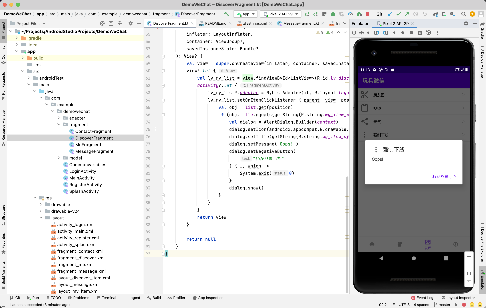

# Final

* 考核：实现简易微信程序

## 编写微信加载界面（引导页面功能）

Handler 是一个消息分发对象。Handler是Android给我们提供用来更新UI的一套机制，也是一套消息处理机制，我们可以发消息，也可以通过它处理消息。在这个部分，本人通过使用Handler实现了Activity延时切换功能。

* 加载页面部分关键代码

```kotlin
class SplashActivity : AppCompatActivity() {
    override fun onCreate(savedInstanceState: Bundle?) {
        super.onCreate(savedInstanceState)
        setContentView(R.layout.activity_splash)
        supportActionBar?.hide()

        Handler().postDelayed(Runnable {
            val intent = Intent()
            intent.setClass(this, LoginActivity::class.java)
            startActivity(intent)
            finish()
        }, 1000)
    }
}
```

* 布局展示


## 编写登录界面随时随地退出程序和记住密码功能

很多时候我们开发的软件需要向用户提供软件参数设置功能，例如我们常用的微信，用户可以设置是否允许陌生人添加自己为好友。对于软件配置参数的保存，如果是windows软件通常我们会采用ini文件进行保存，如果是Android应用，我们可以使用SharedPreferences类，它是一个轻量级的存储类，特别适合用于保存软件配置参数。使用SharedPreferences保存数据，其背后是用xml文件存放数据，文件存放在/data/data/<package name>/shared_prefs目录下。

* 登录界面部分关键代码
  * [x] 随时随地退出
  * [x] 记住密码

```kotlin
override fun onCreate(savedInstanceState: Bundle?) {
    super.onCreate(savedInstanceState)
    setContentView(R.layout.activity_login)

    supportActionBar?.hide()
    common_vars = application as CommonVariables

    val et_username = findViewById<EditText>(R.id.et_username)
    val et_password = findViewById<EditText>(R.id.et_password)

    findViewById<ImageButton>(R.id.ib_exit).setOnClickListener {
        finish()
    }

    findViewById<Button>(R.id.b_login).setOnClickListener {
        login(et_username.text.toString(), et_password.text.toString())
    }

    findViewById<TextView>(R.id.tv_register).setOnClickListener {
        val intent = Intent()
        intent.setClass(this, RegisterActivity::class.java)
        startActivity(intent)
    }

    if (common_vars.user != null) {
        et_username.setText(common_vars.user!!.username)
        et_password.setText(common_vars.user!!.password)
    }
}
```

* 布局展示


## 编写微信聊天界面

* 聊天界面关键代码

```kotlin
override fun onCreateView(
    inflater: LayoutInflater,
    container: ViewGroup?,
    savedInstanceState: Bundle?
): View? {
    val view = super.onCreateView(inflater, container, savedInstanceState)
    view?.let {
        val lv_my_list = view.findViewById<ListView>(R.id.lv_message)
        activity?.let {
            lv_my_list.adapter = MessageListAdapter(it, R.layout.layout_message, list)
            lv_my_list.setOnItemClickListener { parent, view, position, id ->
                val obj = list.get(position)
                Toast.makeText(activity, obj.description, Toast.LENGTH_SHORT).show()
            }
        }

        return view
    }

    return null
}
```

* 布局展示


## 实现强制下线功能

* 强制下线关键代码

```kotlin
val dialog = AlertDialog.Builder(context)
dialog.setIcon(androidx.appcompat.R.drawable.abc_ic_menu_overflow_material)
dialog.setTitle(getString(R.string.my_item_offline))
dialog.setMessage("Oops!")
dialog.setNegativeButton(
    "わかりました"
) { _, which ->
    System.exit(0)
}
dialog.show()
```

* 效果演示



## 实现天气查询功能

* 效果演示


